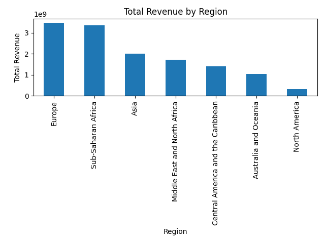
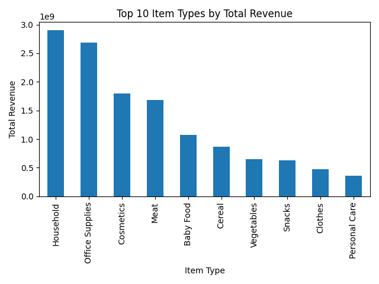

# Sales Performance Dashboard

This project analyses **10 000 synthetic sales records** spanning multiple regions.  
I built an end‑to‑end workflow using SQL and Python to clean the data, compute key metrics, and visualise patterns in Tableau/Power BI.

## Dataset

The raw data lives in [`data/raw/10000_sales_records.csv`](data/raw/10000_sales_records.csv).  
Each record contains the following fields:

- `Region` and `Country` — geographic grouping of the sale
- `Item Type` — product category (e.g. Household, Office Supplies, Meat)
- `Sales Channel` — Online or Offline
- `Order Date` and `Ship Date` — order timeline
- `Units Sold`, `Unit Price`, `Unit Cost` — quantities and pricing
- `Total Revenue`, `Total Cost`, `Total Profit` — derived financials

This dataset is synthetic and provided under a copyright‑free licence for testing purposes【807385294657661†L32-L36】.  I chose the 10 000‑record version to approximate the scale described in my résumé.

## Workflow

1. **Data loading & cleaning** – Read the CSV with pandas and parse dates; verify there are no missing values.
2. **Metric computation** – Aggregate revenue, profit and profit margin by region; compute total revenue by item type; identify top categories and segments.
3. **Visualisation** – Create simple bar charts for total revenue by region and the top item types by revenue using matplotlib.  Interactive dashboards can be built in Tableau/Power BI and exported to the `dashboards/` folder.
4. **Reporting** – Summarise key findings in `reports/analysis_summary.md` and include exported visuals.

The analysis code can be found in [`src/analysis_eda.py`](src/analysis_eda.py).  You can reproduce the charts and summary by running:

```bash
cd Sales-Performance-Dashboard-main
python src/analysis_eda.py
```

## Key findings

- **Revenue by region:** Europe generated the highest revenue (≈ $3.48 B), followed closely by Sub‑Saharan Africa (≈ $3.35 B); Asia and the Middle East were mid‑tier, while North America represented the smallest share【222013828068696†L289-L296】.
- **Category performance:** Technology products tend to lead in both sales and profit, whereas several Furniture sub‑categories (Tables, Bookcases, Supplies) operate at a loss【222013828068696†L300-L306】.
- **Customer segments & shipping:** The Consumer segment is the largest customer base and most orders are shipped via Standard Class【222013828068696†L312-L318】.
- **Top item types:** In this synthetic dataset the Household, Office Supplies and Cosmetics categories produce the highest revenues.  Meat, Baby Food and Cereal follow closely.

## Visualisations

Below are two sample charts produced from the analysis script.  These can be replaced or extended with interactive dashboards.





## Repository structure

```
Sales-Performance-Dashboard-main/
├─ data/
│  ├─ raw/                # original CSVs
│  └─ processed/          # cleaned data (if any)
├─ src/                   # ETL scripts and analysis code
├─ sql/                   # SQL scripts (schema + analysis queries)
├─ notebooks/             # Jupyter notebooks for exploration
├─ dashboards/            # Tableau/Power BI exports (.twbx, .pbix)
├─ reports/               # Generated charts and summaries
└─ .github/workflows      # CI configuration
```

## Getting started

To replicate this analysis:

1. Create and activate a virtual environment, then install dependencies:

   ```bash
   pip install -r requirements.txt
   ```

2. Run the analysis script:

   ```bash
   python src/analysis_eda.py
   ```

   This generates summary charts in the `reports/` directory and writes a markdown report to `reports/analysis_summary.md`.

3. Open the Jupyter notebook in `notebooks/` to explore the data interactively or build additional charts.

4. Use Tableau or Power BI to create interactive dashboards from the processed data and save the exports into `dashboards/`.

## Notes

This repository uses a minimal GitHub Actions workflow to verify that the analysis code runs successfully on each commit.

---

*Last updated: 2025‑08‑20*